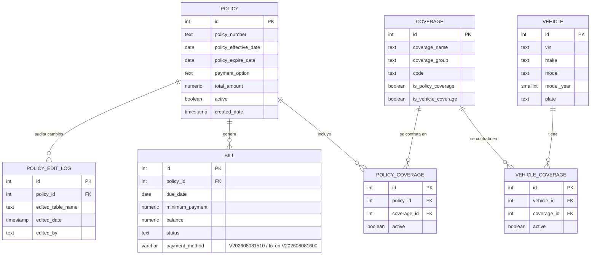

# Dominio de negocio — Cobertura Vehicular

Este proyecto modela el backend transaccional de una aseguradora de vehículos: cada
**póliza** (`policy`) agrupa una o más **coberturas** (`coverage`) — responsabilidad civil,
colisión, asistencia en carretera, etc. — que pueden aplicarse a nivel de la póliza completa
o a un **vehículo** específico asegurado bajo esa póliza. La facturación (`bill`) registra
los cobros periódicos de cada póliza, y cada cambio relevante sobre una póliza queda
auditado en `policy_edit_log`.

Es un dominio deliberadamente distinto al de Parch & Posey (venta de papel) y con la
complejidad suficiente para tener niveles de jerarquía reales: catálogo → póliza → cobertura
aplicada, y póliza → factura → pago.

## Diagrama entidad-relación

Refleja el schema realmente desplegado: el baseline de
[`inyeccion_semilla_equipo_5.py`](../momento1/inyeccion_semilla_equipo_5.py) más las
migraciones de [`sql_migrations/`](../momento1/sql_migrations/) (la tabla `vehicle` y la
columna `bill.payment_method` no existían en el ERD de referencia original — se agregaron
como evolución versionada, no en el baseline).

## Tablas

| Tabla | Descripción | Llave | Relación |
|---|---|---|---|
| `coverage` | Catálogo de tipos de cobertura, con flags de si aplica a nivel póliza y/o vehículo | `id` | — |
| `policy` | Pólizas de seguro vehicular | `id` | — |
| `policy_edit_log` | Auditoría de cambios sobre una póliza | `id` | `policy_id` → `policy.id` |
| `bill` | Facturación periódica de una póliza | `id` | `policy_id` → `policy.id` |
| `policy_coverage` | Coberturas contratadas a nivel póliza | `id` | `policy_id` → `policy.id`, `coverage_id` → `coverage.id` |
| `vehicle` | Vehículos asegurados (agregada en `V202608081500`, no está en el baseline) | `id` | — |
| `vehicle_coverage` | Coberturas contratadas a nivel vehículo | `id` | `vehicle_id` → `vehicle.id`, `coverage_id` → `coverage.id` |

## Origen

Inspirado en el ERD de referencia `Vehicle-coverage-ERD-Example-Graphic-2.png`. Los datos
son sintéticos, generados para fines didácticos.
