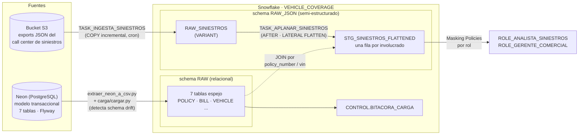

# Momento 2 — Cloud Data Warehouse · RutaSegura

Equipo 5 · Módulo Tendencias emergentes en desarrollo de software (SI6010-5979)

Dos caminos de ingesta hacia Snowflake sobre el proyecto propio del Momento 1, con el
warehouse orquestándose solo y la PII protegida en el dato.



---

## TL;DR

| Qué | Dónde | Estado |
|---|---|---|
| Arquitectura Snowflake como código (warehouse, DB, 3 schemas, rol de servicio) | [`setup_snowflake.sql`](setup_snowflake.sql) + [`json/01`](json/01_esquema_y_stage.sql) | ✅ |
| Ingesta relacional Neon → RAW, con **detección de schema drift** antes de cargar | [`extraer_neon_a_csv.py`](extraer_neon_a_csv.py) + [`carga/`](carga/) | ✅ [evidencia](../docs/evidencias_momento2/drift_provocado_y_corregido.md) |
| Ingesta semi-estructurada: External Stage → `VARIANT` → `LATERAL FLATTEN` | [`json/`](json/) | ✅ contra el bucket real |
| DAG de Snowflake Tasks (raíz con cron → hija con `AFTER`) | [`json/03`](json/03_dag_tasks.sql) | ✅ `TASK_HISTORY` |
| RBAC (2 roles de negocio) + Dynamic Data Masking sobre la PII | [`json/04`](json/04_rbac_masking.sql) | ✅ en vivo (Enterprise) |
| Bitácora de carga + 36 validaciones post-carga | [`bitacora_carga.sql`](bitacora_carga.sql) + [`validaciones/`](validaciones/) | ✅ 36/36 |
| Decisiones de diseño y alternativas descartadas | [`docs/decisiones_momento2.md`](../docs/decisiones_momento2.md) | ✅ |

**La fuente semi-estructurada** es inventada a propósito (el enunciado lo permite):
exports semanales del call center de siniestros, con un array anidado `involved_parties`
(1–3 personas, o **vacío** si el siniestro acaba de reportarse), PII real (teléfonos,
direcciones) y llaves que cruzan con el modelo relacional (`policy_number`, `vin`).
Por qué esta y no otra: [decisiones, sección A](../docs/decisiones_momento2.md).

---

## Cómo reproducir todo desde cero

Cada integrante tiene su propia cuenta de Snowflake — **lo compartido es el código, no
las credenciales**. En una cuenta limpia:

```bash
cp .env.example .env        # completar con TUS credenciales (ver comentarios del archivo)
uv sync
```

En un Worksheet de Snowsight, **en este orden**:

1. [`setup_snowflake.sql`](setup_snowflake.sql) — warehouse, DB, schema RAW, rol `TEAM5_LOADER`
2. [`bitacora_carga.sql`](bitacora_carga.sql) — schema CONTROL + bitácora
3. [`carga/01_file_format_y_stage.sql`](carga/01_file_format_y_stage.sql) — stage relacional
4. [`carga/02_raw_tables.sql`](carga/02_raw_tables.sql) — las 7 tablas destino
5. [`json/01_esquema_y_stage.sql`](json/01_esquema_y_stage.sql) — schema RAW_JSON + External Stage
6. [`json/02_tablas_raw_y_staging.sql`](json/02_tablas_raw_y_staging.sql) — VARIANT + FLATTEN
7. [`json/03_dag_tasks.sql`](json/03_dag_tasks.sql) — el DAG
8. [`json/04_rbac_masking.sql`](json/04_rbac_masking.sql) — roles + máscaras (requiere Enterprise)

Y desde la terminal, cada vez que se quiera cargar:

```bash
uv run extraer_neon_a_csv.py          # Neon -> CSV (7 tablas)
uv run carga/cargar.py                # PUT + COPY INTO -> RAW (con chequeo de drift)
uv run validaciones/validar_carga.py  # 36 validaciones post-carga
```

---

## La demo en 4 actos

Guion completo con tiempos y preguntas probables:
[`docs/guion_sustentacion_momento2.md`](../docs/guion_sustentacion_momento2.md)

**1 · Relacional + drift.** `uv run carga/cargar.py` (7/7). Luego: columna nueva en un
CSV → el script frena ANTES de tocar nada y entrega el `ALTER TABLE` listo → se aplica
→ recarga en verde.

**2 · JSON.** `LATERAL FLATTEN` sobre los siniestros: los campos que el proveedor
agregó después (`email`, `assigned_workshop`) salen `NULL` en los exports viejos — eso
es schema-on-read. Cierre: el JOIN daño-estimado-por-póliza, donde los dos mundos se
cruzan.

**3 · El DAG.** Encender (`SYSTEM$TASK_DEPENDENTS_ENABLE`) → disparar la raíz → la hija
corre sola por `AFTER` → `TASK_HISTORY` como evidencia → apagar **la raíz primero**
(al revés falla con error 091421 — es intencional de Snowflake).

**4 · Gobernanza.** El mismo `SELECT` con tres roles:

```
ROLE_ANALISTA_SINIESTROS  →  +57-301-215-7091      (llama a la gente: ve todo)
ROLE_GERENTE_COMERCIAL    →  +57-301-***-****      (prefijo, sin número marcable)
ACCOUNTADMIN              →  +**-***-***-****      (administrar ≠ necesitar el dato)
```

---

## Estructura de la carpeta

```
momento2/
├── setup_snowflake.sql          arquitectura de la cuenta
├── bitacora_carga.sql           schema CONTROL + tabla de bitácora
├── extraer_neon_a_csv.py        extracción Neon -> CSV
├── conexiones.py                conexión a Neon y Snowflake (compartida)
├── carga/                       ingesta relacional (PUT + COPY, drift, bitácora)
├── validaciones/                36 chequeos post-carga
├── json/                        ingesta semi-estructurada + DAG + gobernanza
│   ├── datos_mock/              los 3 exports canónicos (también en el bucket S3)
│   └── generar_siniestros_mock.py
└── siniestros/                  exploración paralela de la fuente (diseño alterno)
```

> Nota: `siniestros/` fue una exploración paralela del mismo dominio hecha durante el
> diseño; su caso de "claim con array vacío" se incorporó al dataset canónico y al
> `FLATTEN` (`OUTER => TRUE`). El pipeline consume `json/datos_mock/`.
